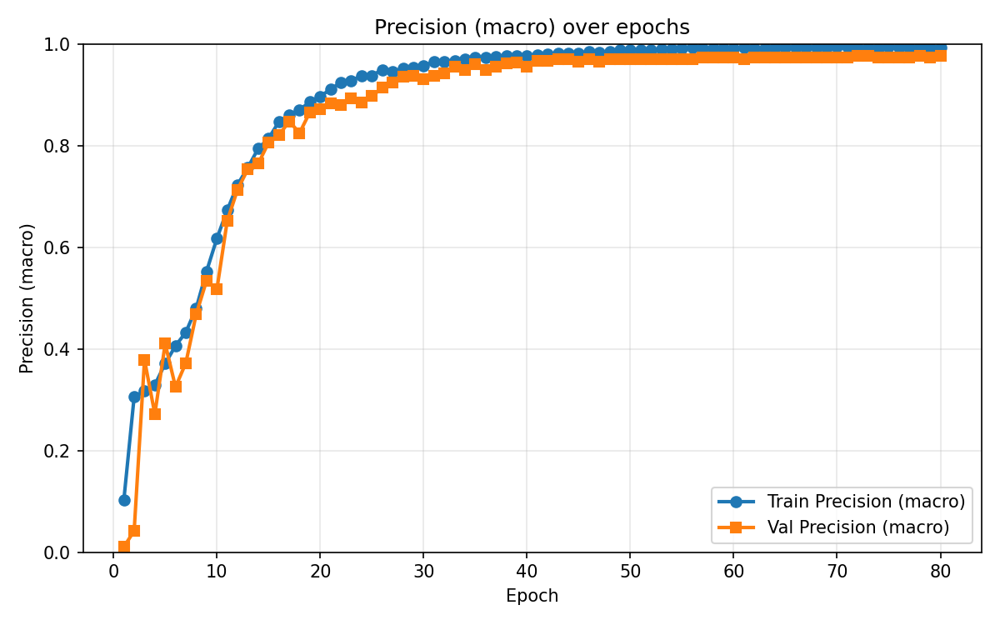
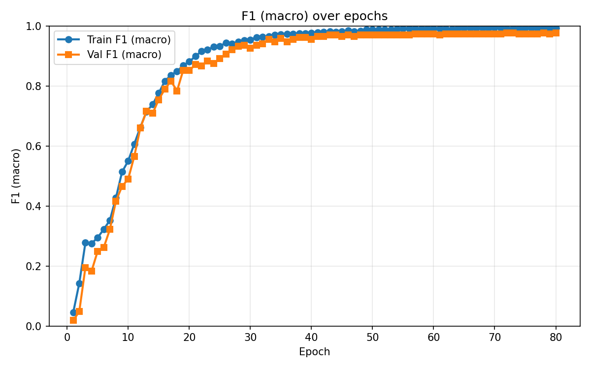

# Cloudwalk Technical Challenge

## Objective
Your task is to build a lightweight prototype that listens to spoken digits (0–9) and predicts the correct number. The goal is to find the lightest effective solution. Live microphone input is used to test the model in real time. This helps explore real-world performance, including latency, noise handling, and usability under less controlled conditions.

---

## Task Evaluation
- Modeling choices: Are the audio features and model type appropriate for the task?  
- Model performance: Is performance measured with relevant metrics, and are the results strong?  
- Responsiveness: Is there minimal delay between input and output?  
- Code architecture: Is the code clean, modular, and easy to extend?  
- LLM collaboration: Is there strong evidence of prompting, debugging, or architectural reasoning with an LLM?  
- Creative energy: Does the submission reflect curiosity or a desire to push boundaries?

---

## Approach
After reading and researching this topic on my own, I came to the table with a few ideas. I first consulted with the LLM to get its opinion on how I should architect this project. After doing so I laid out a framework and prompted the LLM to create specific sections of the project little by little to build it. When a problem arose, I consulted the LLM again and fed its recommendations along with my own back into it to fix the problem at hand. This iterative loop of: research, propose, implement, debug with the LLM—helped me design and resolve issues as they appeared.

---

## Architecture
Model architecture: DS-CNN

Tips:
- Don't cut down on the time axis too aggressively by using large pooling strides; letter sounds are in the hundreds of milliseconds.
- Ensure the model can "see" around the time axis — use stacked small conv layers or slightly larger kernels.
- AUDIO FEATURES are more important than model architecture. Strong default: 40 log-Mel bands, 25 ms window, 10 ms hop.
- Data augmentation tweaking is often better than changing the model.

---

## Audio Features
Log‑Mel Spectrogram

Tips:
- Default best: Log‑Mel 40 bands, 25 ms window, 10 ms hop, ~1 s context window. If PCEN is inconvenient, use plain log‑Mel. (Final model used log-mel.)
- Normalize features consistently at train/infer time (mean/variance normalization or PCEN).

---

## Evaluation of Model
How the model is evaluated:
- Latency (end-to-end): How long from audio input to classification output.
- RAM / CPU usage (resource footprint).
- Accuracy: Proportion of correct predictions out of all predictions.
- Precision: Proportion of correctly predicted positive labels out of all predicted positives.
- F1: Harmonic mean of precision and recall — overall model accuracy on dataset.

---

## Code Functions / Classes (Status)
- Evaluation - Completed ✅  
  Prompt: Add an evaluation module to the training portion for the DS-CNN. Evaluate latency (end-to-end), accuracy, precision, and F1. Generate graphs and save to `Plot results`.

- Model - Completed ✅  
  Class: DS-CNN model  
  Methods: __init__, forward  
  Prompt: Implement depthwise-separable CNN in PyTorch for speech-digit recognition. Defaults: 40 log-Mel bands, 25 ms window, 10 ms hop. Include training loop and train/validation splits.

- Dataloading - Log-mel - Completed ✅  
  Prompt: Load dataset from Hugging Face (`mteb/free-spoken-digit-dataset`) and derive label names from dataset. Preprocess audio into Log‑Mel spectrograms. Output features in format suitable for DS-CNN.

- Sanity Test - Completed ✅  
  Prompt: Sanity test script that visualizes preprocessed log-mel spectrograms for debugging.

- Audio Input from User - Completed ✅    
  Prompt: Microphone input interface (Ubuntu). Requirements:
  1. Prompt user to start/stop recording.
  2. Load trained model from `/models/dscnn_best.pt`.
  3. Preprocess recorded audio using same log-mel settings.
  4. Run inference and print prediction to terminal.

---

## Issues Encountered
1. The first issue I encountered was when I prompted the LLM to create the dataloading and preprocessing module. The first iteration of the code it created was failing to run due to the torchaudio library not having the proper PCEN module installed on my current PyTorch version. To solve this I prompted the LLM to look for solutions and it recommended for me to create a fallback PCEN module to run in the case the machine the program is running on does not have this module — because some versions of the PyTorch library have this module under different names or not at all. Once I implemented the PCEN fallback.
2. The second problem arose with the PCEN function: the s coefficient was not being passed in or initialized properly. To fix this the LLM suggested setting a default value for s, ensuring its value is within a valid range, and validating that s is always of type tensor.
3. My third issue arose when I was trying to edit my training loop to include the evaluation metrics I wanted to track. My IDE trims the messages when the prompt and attachments exceed 5% of the context window. To solve this — since the IDE attaches the current file to your prompt — I turned that feature off and attached only the code I wanted it to edit.
4. My fourth issue was a problem with the PCEN preprocessing module. PyTorch did not have a library for PCEN processing, so I had the LLM create one. I realized there was an issue because the model was not learning: the loss and accuracy metrics were not changing much after each epoch. I then had the LLM create a sanity test to print a visual representation of the audio files after the preprocessing, and from the image I could tell it was cutting out most of the audio signals. After many iterations the PCEN was still not implemented correctly. I decided to only use log-mel for the preprocessing. After I implemented log-mel as the only preprocessing step, the model started to learn!
5. My fifth issue was the notebook kernel using the same cached values for the CUDA GPU and the global variables. This caused the program to use the same training data split from the previous run. I prompted the LLM to ensure these variables and training data are reset after each training session.

---

## Results
After iterating on training and evaluation (tuning learning rate, batch size, epochs), the model classified speech digits well. With more time and further refinement (augmentation, hyperparameter search), the model could be made more robust.

---

## Graphs
The training / evaluation graphs are saved in the `Plot results` folder. Included graphs:

- Accuracy over epochs  
  

- Precision (macro) over epochs  
  

- F1 (macro) over epochs  
  

- Final test metrics (Accuracy / Precision / Recall / F1)  
  

- Model-only latency summary (ms)  
  

If you don't see these images rendered in your viewer, ensure the `Plot results` folder exists at the repository root and contains the PNG files listed above.

---

## How to run
1. Install requirements (PyTorch + torchaudio, datasets, numpy, matplotlib).  
2. If you want to create and train another model:
   1. Run the preprocessing cells to create the log-mel features.
   2. Run the training cells to train the model.
   3. Run evaluation to regenerate graphs saved into `Plot results`.
   4. Run the microphone inference script on Ubuntu to test live input.
3. If you want to use the pre-trained model:
   1. Run the Dataloading & preprocessing cells as well as the DS-CNN model cell.
   2. Run the microphone inference script on Ubuntu to test live input. 

---